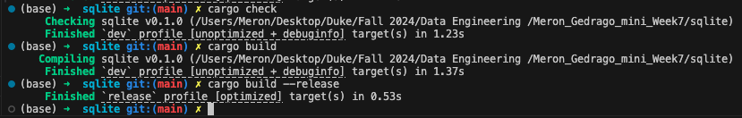
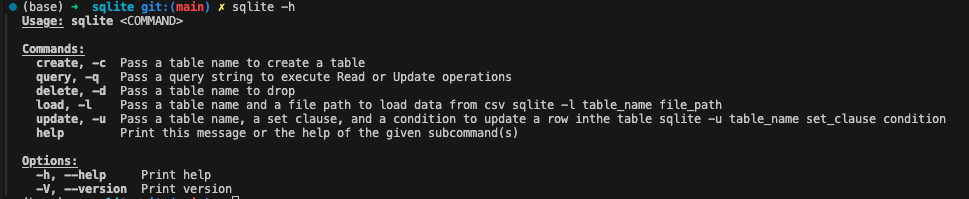
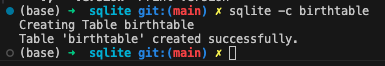
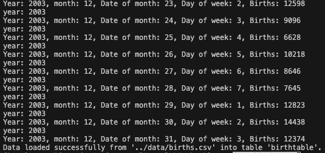
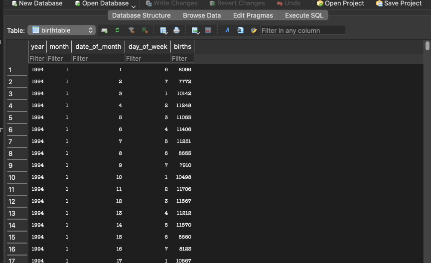
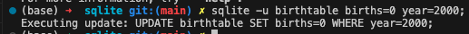
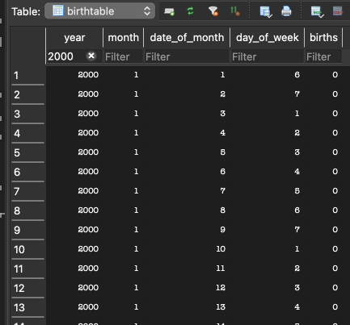
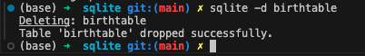
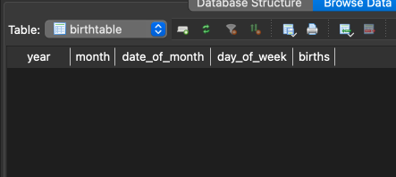
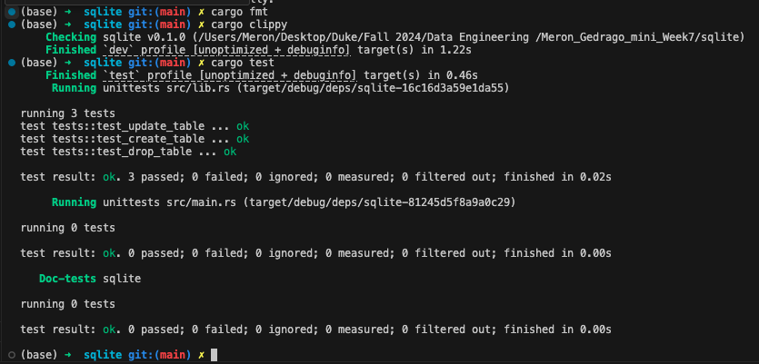

# Meron Gedrago miniproject Week 7 
[](https://github.com/nogibjj/Meron_Gedrago_mini_Week7/actions/workflows/CI.yml)

## Structure for this project 

```
├── .devcontainer/
│   ├── devcontainer.json
│   └── Dockerfile
├── .github/
│   └── workflows/
│        └──cicd.yml
├── sqlite/src/
│   ├── lib.rs
│   └── main.rs 
├── .gitignore
├── visuals
├── Cargo.toml
├── Cargo.lock
├── Makefile
└── README.md

```

## Purpose of the project  

This project aims to setup and show how to use CLI in rust. The CLI functionalities are based on prior project ([Meron_Gedrago_mini_Week5](https://github.com/nogibjj/Meron_Gedrago_mini_Week5)) in python where I show how to perform CRUD (Create, Read, Update and Delete) operation on a dataset from [fivethirtyeight](https://github.com/fivethirtyeight/data/tree/master/births). 

## Instruction on using the CLI 

### Compiling and preparation for use 

Since we are working with rust, we need to first check if there any issues with our written code and compile/build our script before we can use our CLI. We can run the following commands below to get started and the outputs of are pictured below:

- cargo check
- cargo build 
- cargo build --release




### Manual for CLI 

Now that we have compiled our code, we can now start using our CLI functionalities by typing 'sqlite -h' to ask for the directory/manual of the CLI. We will then see the direction pictured below for the different functionalities in this project: 



### Demo of the CLI 
#### create an empty table / 'sqlite -c' - *create an empty table called birthtable*


#### load data into the created table / 'sqlite -l' - *load into birthtable from my data directory of csv file*




We can also check and see that it has been successfully changed using DB browser on my local computer 




#### updated data / 'sqlite -u' - *update rows of the birthtable by changing births to 0 if the year is 2000*

Instruction that I gave is below:



Visualization of how the change was reflected using DB browser on my local computer



#### Delete table / 'sqlite -d' - *delete the birthtable I created*



Refreshing on my local computer and checking if it is really deleted



## Format, lint and test before pushing to github 

We can format, lint and test using the following commands before pushing to github. These will still be executed or tested during CI/CD but it could help us catch any errors before commiting and pushing 
- cargo fmt - for formatting 
- cargo clippy - for linting 
- cargo test - for running test that is included in the lib.rs 




 [Link to binary](https://github.com/nogibjj/Meron_Gedrago_mini_Week7/actions/runs/11494954964/artifacts/2097648149)